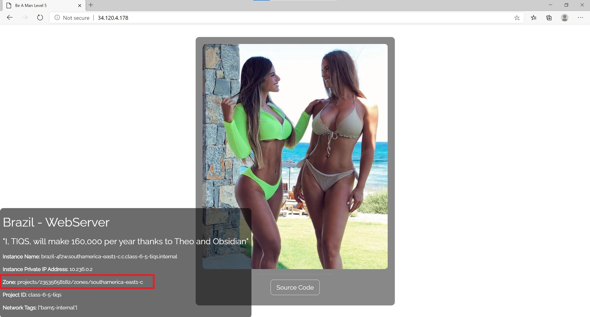

# 🧠 Be A Man Level 5 – Classic Load Balancing


---

This project automates the deployment of a multi-region GCP infrastructure using **Terraform.** It includes a Windows VM in a public subnet, a load-balanced set of Linux VMs in a **private subnet, autoscaling, firewall rules, and a fully customized HTML page.**

---

## 🧱 Project Structure

```plaintext
gcp-be-a-man-level-5/
.
├── .gitignore
├── 0-authentication.tf
├── 1-provider.tf
├── 2-variables.tf
├── 3-vpc.tf
├── 4-subnets.tf
├── 5-firewalls.tf
├── 6-vm-instances.tf
├── 7-instance-template.tf
├── 8-mig.tf
├── 9-health-checks.tf
├── 10-autoscale-policy.tf
├── 11-lb.tf
├── 12-outputs.tf
├── brazil.sh
├── README.md
└── Screenshots/
    ├── brazil1.jpg
    ├── brazil2.jpg
    ├── brazil3.jpg
    ├── firewall-rules-with-tags.jpg
    ├── load-balancer-summary.jpg
    ├── managed-instance-group-summary.jpg
    └── rdp-server-to-load-balancer-app.jpg
```

---

## 🚀 Key Features

- **1 VPC**, spanning **2 regions**
- **Windows VM** in North America with RDP access
- **Regional MIG** in South America behind **internal HTTP load balancer**
- **Custom startup script** with inspirational content
- **Autoscaling** based on CPU utilization
- **Tag-based firewall rules** for security isolation
- **Outputs** to fetch RDP and Load Balancer IPs

---

## 📂 Terraform File Summaries

- **`0-authentication.tf`**: Handles GCP service account authentication using a credentials JSON file.

- **`1-provider.tf`**: Configures the Terraform provider for Google Cloud, specifying project and region.
- **`2-variables.tf`**: Declares variables used throughout the Terraform project, including regions, zones, and names.

- **`3-vpc.tf`**: Defines the custom VPC to be used across both regions.

- **`4-subnets.tf`**: Creates regional subnets for public (North America) and private (South America) usage.

- **`5-firewalls.tf`**: Sets up firewall rules for RDP access and internal traffic control using tags.

- **`6-vm-instances.tf`**: Creates a Windows VM in the public region with RDP access enabled.

- **`7-instance-template.tf`**: Defines the instance template used for launching Linux VMs in the MIG.

- **`8-mig.tf`**: Provisions a Regional Managed Instance Group (MIG) spread across 3 zones in South America.

- **`9-health-checks.tf`**: Configures HTTP health checks used by the load balancer to monitor VM health.

- **`10-autoscale-policy.tf`**: Implements autoscaling policy for the regional MIG based on CPU utilization.

- **`11-lb.tf`**: Defines the global HTTP(S) load balancer components including backend service, URL map, and proxy.

- **`12-outputs.tf`**: Outputs the RDP IP and internal load balancer IP after deployment.

- **`brazil.sh`**: Custom startup script for Linux VMs with motivational HTML output and visual customizations.

---

## 🛠️ Deploy This Project

```bash
terraform init
terraform validate
terraform fmt
terraform plan
terraform apply -auto-approve
```

---

## 🖼️ Screenshots

| Description | File |
|------------|------|
| **Load Balancer Summary** |  |
| **MIG Summary** |  |
| **Firewall Rules** |  |
| **RDP-to-Web Connection** |  |
| **VM Instance (Zone A)** |  |
| **VM Instance (Zone B)** |  |
| **VM Instance (Zone C)** |  |

---

## 🧹 Teardown Instructions

> To clean up all resources created by this project and avoid incurring GCP charges, run the following command:

```bash
terraform destroy -auto-approve
```

This will:

- Delete the VPC and associated subnets
- Terminate the Windows and Linux VMs
- Remove the regional managed instance group
- Destroy the internal load balancer
- Remove all firewall rules, health checks, and outputs

> Make sure your service account still has sufficient permissions to delete these resources.

## 🛠️ Troubleshooting

| Issue | Resolution |
|-------|------------|
| Load balancer shows "unhealthy" | Ensure Apache is running and firewall allows health checker IPs (`130.211.0.0/22`, `35.191.0.0/16`) |
| RDP not accessible | Verify firewall rule with tag `rdp-public` allows **TCP:3389** |
| No webpage on Linux VM | Check `brazil.sh` script executed, and Apache is running on port 80 |
| Autoscaler not working | Use `google_compute_region_autoscaler` for regional MIGs and ensure `target` matches MIG |
| Global LB not attaching to MIG | Make sure you're using a zonal or regional MIG and referencing the correct group type in backend config |

---

## ✍️ Authors & Acknowledgments

- **Author:** T.I.Q.S.
- **Group Leader:** John Sweeney

### 🙏 Inspiration

This project was built with inspiration, mentorship, and guidance from:

- Sensei **"Darth Malgus" Theo**
- Lord **Beron**
- Sir **Rob**
- Jedi Master **Derrick**

---
